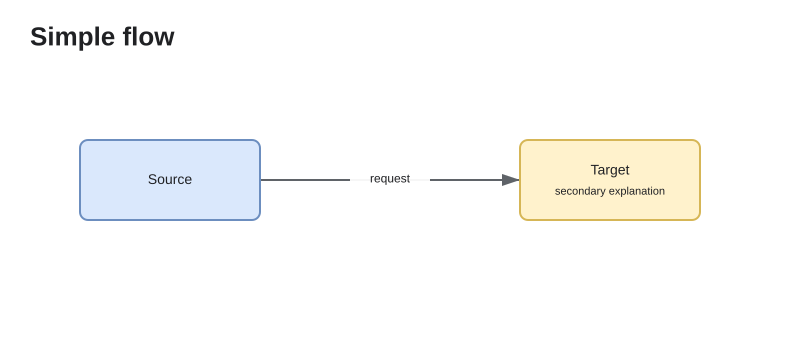
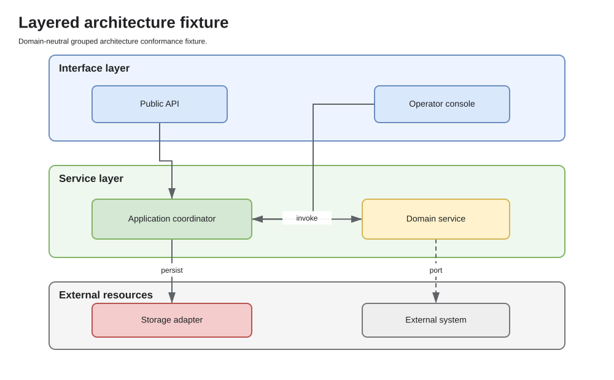
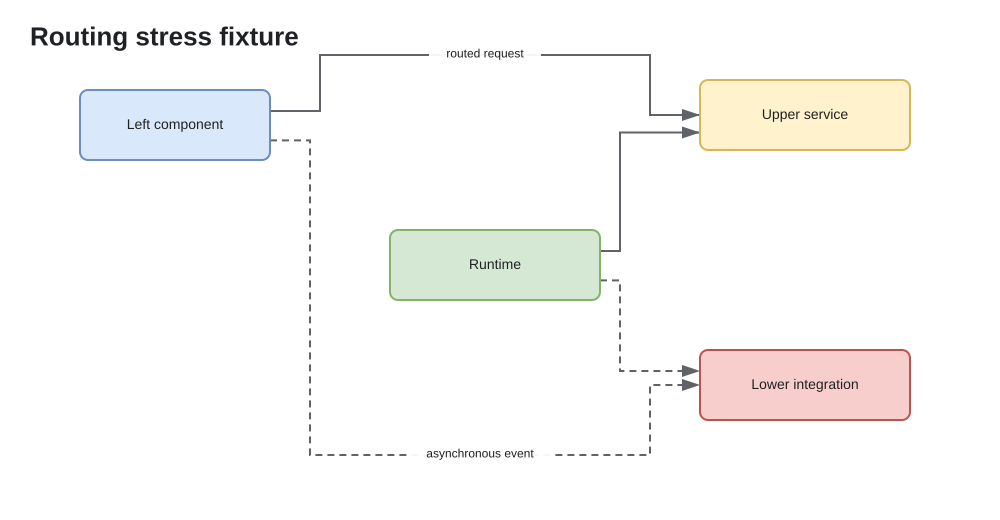

# tool.eng-docs generated conformance documentation

Generated from source commit `24c684ac5613ed8750cbe0a552bae24e1073a427`.

These fixtures are intentionally domain-neutral. The SVG output is the quickest visual review; the draw.io files verify that the same diagrams remain natively editable.

## Simple flow

[Source YAML](fixtures/simple-flow.yaml) · [Editable draw.io](diagrams/simple-flow.drawio)

## Layered architecture

[Source YAML](fixtures/layered-architecture.yaml) · [Editable draw.io](diagrams/layered-architecture.drawio)

## Routing stress

[Source YAML](fixtures/routing-stress.yaml) · [Editable draw.io](diagrams/routing-stress.drawio)

