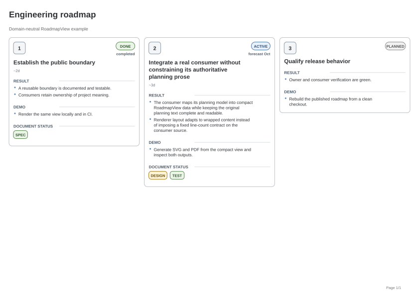
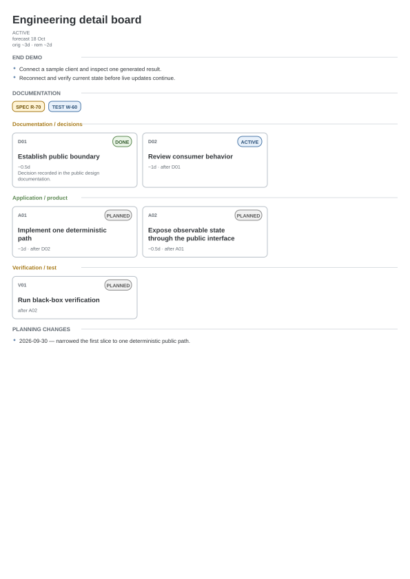
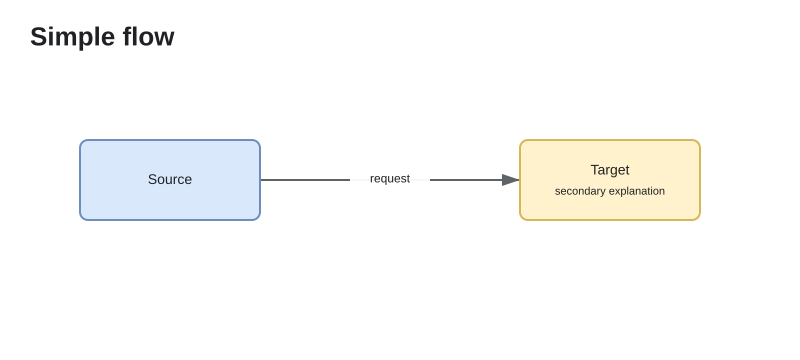
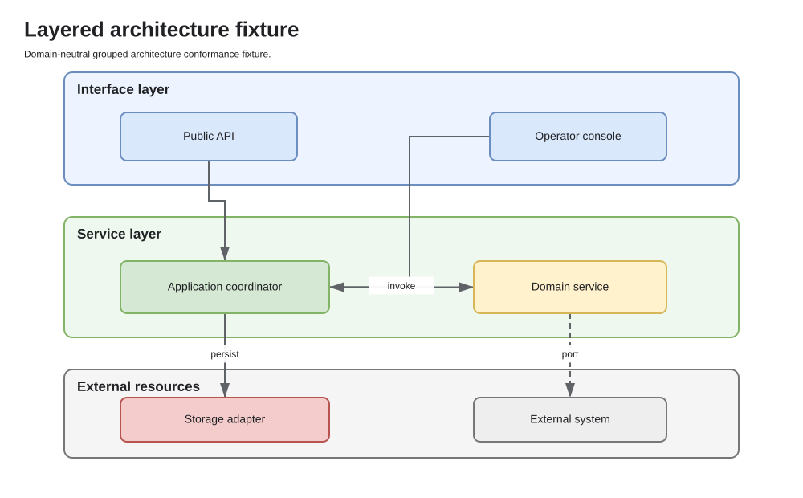
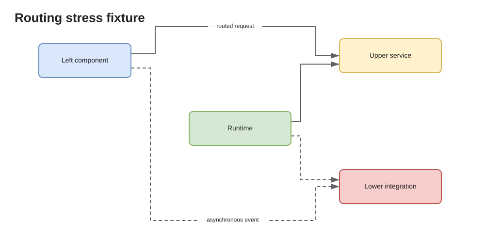

# tool.eng-docs generated conformance documentation

Generated from source commit `a9b6dcf94f9a0b5986b1cadd76bde47102566977`.

This branch is review evidence for the reusable documentation capabilities. The generated files are intentionally inspectable without opening an Actions log.

## Owner test evidence

- [pytest output](evidence/pytest.txt)
- [source revision](source-sha.txt)

## Document assembly example

The example keeps ordinary source Markdown readable, inventories an already-produced SVG through a manifest, and assembles a self-contained publication copy.

- [assembled document index](assembly/documents/README.md)
- [assembled document](assembly/documents/overview.md)
- [assembly provenance](assembly/assembly-info.yml)
- [localized asset](assembly/assets/architecture/system.svg)
- [assembly configuration](assembly/_input/assembly.yml)
- [source Markdown before assembly](assembly/_input/overview.md)
- [producer asset manifest](assembly/_input/assets.yml)

## Engineering graph example

The example shows native MyST authoring, its Sphinx-Needs export, normalized outgoing/incoming context and a diagram identity reference to the same engineering object.

- [human graph review](graph/review.md)
- [normalized graph JSON](graph/engineering-graph.json)
- [native MyST source](graph/input/source.md)
- [Sphinx-Needs export](graph/input/needs.json)
- [diagram identity source](graph/input/system.yaml)

## Roadmap rendering example

The RoadmapView example is presentation data rather than a planning source model. The same local CLI path produces SVG and PDF.

- [source YAML](roadmap-example/source.yaml)
- [panorama SVG](roadmap-example/roadmap.svg)
- [printable PDF](roadmap-example/roadmap.pdf)

## Detail-board rendering example

BoardView keeps project semantics in the consumer while reusing the same print-friendly presentation style.

- [source YAML](board-example/source.yaml)
- [SVG](board-example/board.svg)
- [printable PDF](board-example/board.pdf)

## Diagram conformance

The SVG output is the quickest visual review; the draw.io files verify that the same diagrams remain natively editable.

### Simple flow

[Source YAML](fixtures/simple-flow.yaml) · [Editable draw.io](diagrams/simple-flow.drawio)

### Layered architecture

[Source YAML](fixtures/layered-architecture.yaml) · [Editable draw.io](diagrams/layered-architecture.drawio)

### Routing stress

[Source YAML](fixtures/routing-stress.yaml) · [Editable draw.io](diagrams/routing-stress.drawio)

